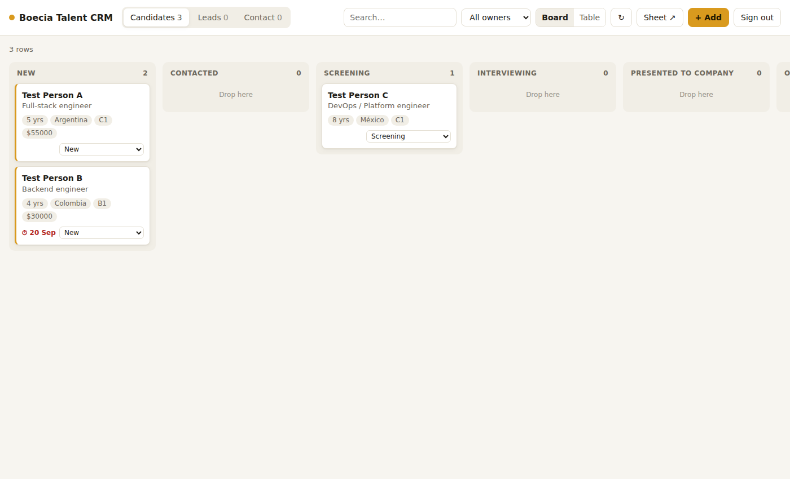

# Boecia Talent CRM: web interface

This is a small website for working the **Boecia Talent CRM** Google Sheet, hosted at your own address (e.g. `crm.yourdomain.com`). You can:

- see Candidates, Leads and Contact messages as a board, one column per stage
- drag cards between stages, or use the dropdown on each card on a phone
- open any row to edit Owner, Next step, Next step date, Notes or any other field
- add rows by hand, e.g. a LinkedIn contact who replied becomes a Lead
- delete rows (a copy goes to an `Archive · <tab>` sheet first, so nothing is lost)
- search, filter by owner, and switch to a sortable table view



## How it works

- **No server and no secrets.** It's plain HTML and JavaScript. You sign in with Google, and your browser reads and writes the sheet directly through the Google Sheets API, as you.
- **Only people the sheet is shared with can see any data.** Everyone else gets "no access", even if they find the address.
- **It doesn't touch the Tally script.** New Tally submissions appear on their own; the page refreshes every minute.
- **It costs nothing.** You use three free accounts: Google Cloud (only for the sign-in button, no billing needed), Cloudflare Pages (hosting, allowed for business use), and the domain you already own.

## Setup (about 20 minutes, once)

### 1. Google Cloud: get a sign-in client ID
1. Go to <https://console.cloud.google.com> and create a project called **Boecia CRM**. Don't enable billing.
2. Go to **APIs & Services → Library**, search **Google Sheets API**, and click **Enable**.
3. Go to **Google Auth Platform** (older consoles call it **OAuth consent screen**):
   - **Branding:** app name `Boecia Talent CRM`, with your email as the support and contact email.
   - **Audience:** User type **External**, publishing status **Testing**. Under **Test users**, add your Gmail, and later anyone else who should use the CRM.
   - **Data access:** add the scope `.../auth/spreadsheets`.
4. Go to **Clients** (or *Credentials → Create credentials → OAuth client ID*) and set:
   - Application type **Web application**
   - **Authorized JavaScript origins:** `https://crm.yourdomain.com` and `http://localhost:8080`
   - Leave *redirect URIs* empty.
5. Copy the **Client ID** (it ends in `.apps.googleusercontent.com`). Paste it into [`public/config.js`](public/config.js) as `GOOGLE_CLIENT_ID`, then commit.

In Testing mode, Google shows a "Google hasn't verified this app" screen the first time each person signs in. Click **Continue**. That's normal for a private tool, and it stays free.

### 2. Cloudflare Pages: host the site
1. Create a free account at <https://dash.cloudflare.com>.
2. Go to **Workers & Pages → Create → Pages → Connect to Git**, and pick the GitHub repo `valentinbarta/portfolio`.
3. Build settings:
   - Framework preset: **None**
   - Build command: *(leave empty)*
   - Build output directory: **`boecia-crm/public`**
   - Production branch: the branch that holds this folder, for example `main` once it's merged.
4. Click **Save and Deploy**. You get an address like `boecia-crm.pages.dev`.
5. In the project, open **Custom domains → Set up a custom domain** and enter `crm.yourdomain.com`.

### 3. Your domain registrar: point the subdomain
Where you bought the domain (GoDaddy, Namecheap, etc.), add a DNS record:

| Type | Name | Value |
|------|------|-------|
| CNAME | `crm` | `boecia-crm.pages.dev` (the address from step 2.4) |

Cloudflare issues the HTTPS certificate on its own, usually within minutes. Then open `https://crm.yourdomain.com` and sign in.

## Giving someone else access
1. Share the Google Sheet with them as **Editor**.
2. Add their Gmail under **Google Auth Platform → Audience → Test users** (up to 100 people).

To remove access, un-share the sheet.

## Everyday notes
- **Sessions last about an hour.** When one expires, a **Reconnect** button appears. It's one click, with no password if you're still signed in to Google.
- **Changing the code:** push to the production branch and Cloudflare redeploys within a minute.
- **Running it on your computer:** `npm run serve` (inside `boecia-crm/`), then open <http://localhost:8080>.

## How it treats the sheet
- **Rows are matched by `Submission ID`,** not row number, so Tally appending rows while you work is safe. Rows typed straight into the sheet with no ID get an `M-xxxxxxxx` ID the first time the site loads them.
- **Columns are found by header name.** You can reorder or add columns in the sheet, but don't rename `Stage`, `Status` or `Submission ID`.
- **Stages come live from the `Lists` tab.** Add or rename a stage there and the board follows.
- **`Received`, `Submission ID` and `Form` are read-only** (same rule as the Lists tab).
- **`Next step date` is saved as a real date,** so the Dashboard's "Next steps due" keeps working.
- **Text starting with `=` is saved as plain text,** never as a formula.

## Tests
```bash
cd boecia-crm && npm test
```
The tests run the data layer (`public/sheets.js`) against an in-memory fake of the Google Sheets API that uses the real header rows.
